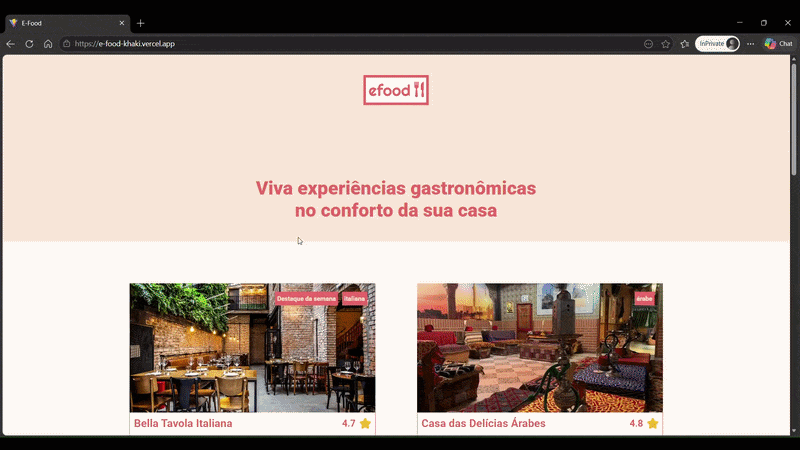

<div align="center">
  
</div>

# 🍴 efood - Delivery de Gastronomia

O **efood** é uma plataforma de delivery de comida focada em restaurantes selecionados, oferecendo uma experiência de compra fluida desde a seleção de pratos até o checkout final. 

Este projeto foi desenvolvido como parte do curso de Desenvolvedor Front-end da **EBAC (Escola Britânica de Artes Criativas e Tecnologia)**.

---

## 🚀 Tecnologias Utilizadas

O projeto utiliza o que há de mais moderno no ecossistema React para garantir performance, tipagem estática e gerenciamento de estado eficiente:

*   **React** (com Hooks e Functional Components)
*   **TypeScript** (Garantindo segurança de tipos em toda a aplicação)
*   **Redux Toolkit** (Gerenciamento de estado global para o Carrinho e Modais)
*   **RTK Query** (Consumo de API, cache e mutações de dados)
*   **Styled Components** (Estilização baseada em componentes e CSS-in-JS)
*   **Formik & Yup** (Criação de formulários complexos com validações rigorosas)
*   **React Router Dom** (Navegação entre Home e Perfil de Restaurantes)

---

## 🛠️ Funcionalidades Principais

### 1. Catálogo de Restaurantes
*   Listagem dinâmica consumindo API oficial.
*   Página de detalhes para cada restaurante com cardápio específico.

### 2. Gerenciamento de Carrinho (Redux)
*   Adição de pratos via modal de detalhes.
*   Remoção de itens diretamente na Sidebar do carrinho.
*   Cálculo automático de valor total.
*   Persistência de interface (o carrinho mantém os itens enquanto o usuário navega).

### 3. Fluxo de Checkout Inteligente
*   **Persistência de Dados:** O formulário mantém as informações de entrega e pagamento mesmo se o usuário voltar para adicionar mais pratos.
*   **Validação em Tempo Real:** Feedback visual para o usuário (campos obrigatórios, formato de CEP e cartão) utilizando Yup.
*   **Integração com API:** Envio dos dados de pedido via método POST e recebimento de ID de confirmação.
*   **Feedback de Sucesso:** Tela de confirmação personalizada após a resposta do servidor.

### 4. Responsividade
*   Interface adaptável para dispositivos móveis, tablets e desktop.
*   Modais e Sidebar do carrinho otimizados para telas pequenas.

---

## 📦 Como rodar o projeto

1.  Clone este repositório:
    ```bash
    git clone [https://github.com/seu-usuario/efood.git](https://github.com/seu-usuario/efood.git)

2. Instale as dependências:
   ```bash
   npm install

3. Inicie o servidor de desenvolvimento:
   ```bash
   npm run dev

4. Para gerar a versão de produção (build):
    ```bash
    npm run build

---

📄 Licença
Este projeto foi desenvolvido para fins educacionais.

---

## 👨‍💻 Autor
**Gustavo Inglez**

*   **LinkedIn:** [linkedin.com/in/gustavo-inglez](https://www.linkedin.com/in/gustavo-inglez/)
*   **GitHub:** [github.com/gugainglez2](https://github.com/gugainglez2)

---
